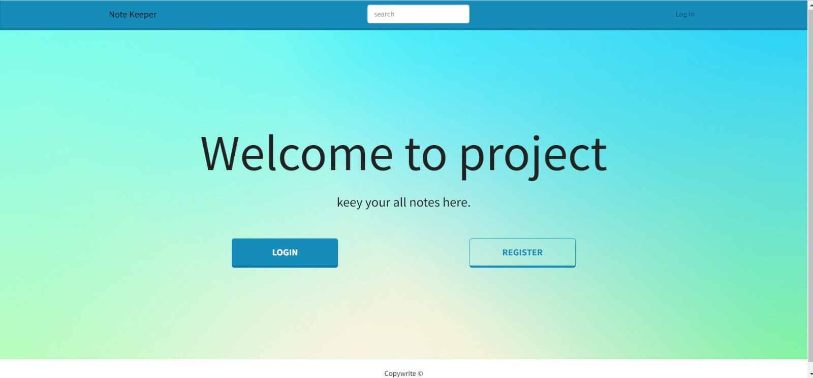

# Note Keeper 

"Note Keeper" is a full-stack web application developed using MERN stack that allows users to manage their notes effortlessly. With this application, users can create, update, read and delete their notes with just a few clicks.

## Features

- User Authentication: Keep Note provides secure user authentication with JWT tokens to ensure the safety of user's data.
- All CRUD Options

## Tech Stack

**Client:** ReactJS, Material-UI

**Server:** Node.js, Express.js

**Database:**  MongoDB

**Programming Language:** Javascript

## All Sections

